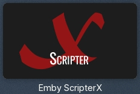
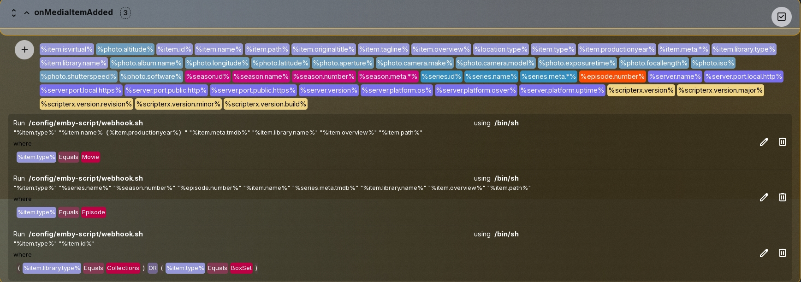

# Emby-Slack-notification

Emby原装的slack通知太简陋了，编写了这个增强Emby入库通知（Slack通知）的脚本，当电影和剧集在Emby成功入库后，Slack将收到通知

## 前置条件
1、在Emby中安装 ***Emby Scripter-X*** 插件  

  

2、slack应用开启 ***webhook***  

3、需要你的 ***tmdb api key***  

(可选) 4、文件名需要包含分辨率的信息，例如：  
```007：大破量子危机.2008-1080p.mp4```  
```谈判专家.2024-2160p.mkv```  
```曼达洛人.S01E01-4k.mkv```  

（如果不包含分辨率信息的文件太多，或者不需要，可以修改脚本中的内容，具体最后）

## 效果图

  
  

## 使用方法

将压缩包的所有文件放在同一个地方，然后配置，即可，***注意文件夹结构***

## 配置Scripter-X

#### 如图所示

  

### 图中Run为脚本存放的路径；using为使用方法（选择/bin/sh）
### where按图中配置选择条件

### 电影  

```
"%item.type%" "%item.name%（%item.productionyear%）" "%item.meta.tmdb%" "%item.library.name%" "%item.overview%" "%item.path%"
```

对应属性为  

```
类型 名字（年份） tmdbID 入库的库名 电影概述 文件路径
```

### 剧集

```
"%item.type%" "%series.name%" "%season.number%" "%episode.number%" "%item.name%" "%series.meta.tmdb%" "%item.library.name%" "%item.overview%" "%item.path%"
```

对应属性为  

```
类型 系列名称 季数 集数 条目名字 tmdbID 入库的库名 电影概述 文件路径
```


### 合集（本来想用于Emby-Pinyin的，结果Emby原生没有这个webhook，也没关于boxset的通知，所以暂不支持，等Emby更新吧）

## 配置脚本

#### 将脚本中webhook地址替换为你slack应用的webhook地址

```webhook_url='https://hooks.slack.com/services/xxxxxxxxxxxxx'```

#### 将你的Tmdb Api key填入

```Tmdb_api_key="xxxxxxxxxx"```

### 如过不需要或者文件名不包含分辨率信息

找到```\n媒体格式：$MEIDA_FORMAT```这一段，直接删除，或者记事本Ctrl+h，查找替换为```空格```
